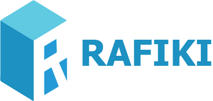

# RAFIKI
## Logo

## Project

RAFIKI was created within the curricular unit "Programação Web I" of "TSIW -Tecnologias e Sistemas de Informação para Web" degree.

Our project consists on developling a friendly web application where students are allowed to expose their doubts, while colleagues and teachers provide answers. Users may compete with each other while working together to solve any problem that may occur.

## RAFIKI setup
```
npm install
```

### Compiles and hot-reloads for development
```
npm run serve
```

### Compiles and minifies for production
```
npm run build
```

######################################### 

## RAFIKI Structure
```
*app --> Application Files    
    *public
        *index.html 
    
    *src

        *assets -->CSS and stuff. Directory where we save bootstrap

        *components--> All the components we need and we will use
    
        *views --> All the pages we will have in our app
        
        *APP.VUE--> Parent View
        
        *main.js --> Rendering the APP.vue to index.html
        
        
        *router.js --> All the Paths
        
        *stores.js--> Save our data
        
    *configuration files
    
*logo--> company logo

*mockups --> Mockups Directory
    *PDF File
    *Xd File

```
